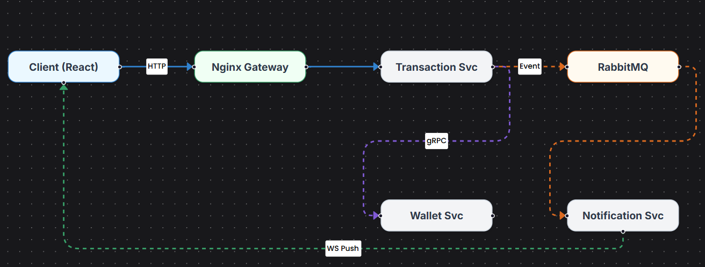

# GoP2P Wallet - Microservices Payment Platform


**GoP2P Wallet** is a high-performance, microservices-based peer-to-peer payment platform designed to mimic real-world fintech architecture. It enables instant money transfers between users with bank-level security, ACID-compliant ledger transactions, and real-time notifications.

This project demonstrates a production-ready stack using **Golang** for backend services, **React 19** for the frontend, and a robust infrastructure orchestrated via **Docker Compose**.

---

## 🏗️ Architecture

The system is composed of four decoupled microservices that communicate via **gRPC** (for synchronous, critical operations like money movement) and **RabbitMQ** (for asynchronous events like notifications). An **Nginx** gateway routes external traffic to the appropriate services.



### Microservices
- **User Service:** Handles user registration, authentication (JWT), and profile management.
- **Wallet Service:** Manages user balances and performs double-entry ledger recording for all transactions.
- **Transaction Service:** Orchestrates money transfers, ensuring atomicity and consistency across services.
- **Notification Service:** Listens for transaction events via RabbitMQ and pushes real-time updates to the frontend via WebSockets.

---

## 🛠️ Tech Stack

### Backend
- **Language:** Golang (v1.24)
- **Framework:** Gin (HTTP REST API)
- **Communication:** gRPC & Protobuf (Inter-service), RabbitMQ (Event-driven)
- **Database:** PostgreSQL (with GORM)
- **Auth:** JWT (JSON Web Tokens)

### Frontend
- **Framework:** React 19 (Vite)
- **Language:** TypeScript
- **UI Library:** Chakra UI
- **State/Data:** TanStack Query
- **Visualization:** React Flow (Architecture Diagrams)
- **Docs:** Swagger UI

### Infrastructure
- **Containerization:** Docker & Docker Compose
- **Gateway:** Nginx (Reverse Proxy)
- **Message Broker:** RabbitMQ
- **Database:** PostgreSQL

---

## ✨ Key Features

- ** Secure Authentication:** JWT-based stateless authentication.
- ** ACID Transactions:** Robust double-entry ledger system ensures money is never lost or created out of thin air.
- ** Instant Transfers:** High-speed P2P transfers using gRPC for low-latency communication.
- ** Real-time Updates:** WebSocket integration for instant transaction notifications.
- ** Engineering Dashboard:** Live view of system health, interactive architecture diagrams, and API documentation.

---

## 🚀 Getting Started

Follow these steps to run the entire platform locally.

### Prerequisites
- Docker & Docker Compose installed.
- Git installed.

### Installation

1.  **Clone the repository:**
    ```bash
    git clone https://github.com/Gupta5804/gop2pwallet.git
    cd gop2pwallet
    ```

2.  **Start the application stack:**
    ```bash
    docker-compose up --build
    ```
    *This command will build the Go binaries, the React frontend, and spin up Postgres and RabbitMQ containers.*

3.  **Access the application:**
    - **Frontend:** [http://localhost:3000](http://localhost:3000)
    - **API Gateway:** [http://localhost:80](http://localhost:80)

---

## 🌐 Live Demo

Check out the live demo here: [https://gop2pwallet.pp.ua/](https://gop2pwallet.pp.ua/)

---
